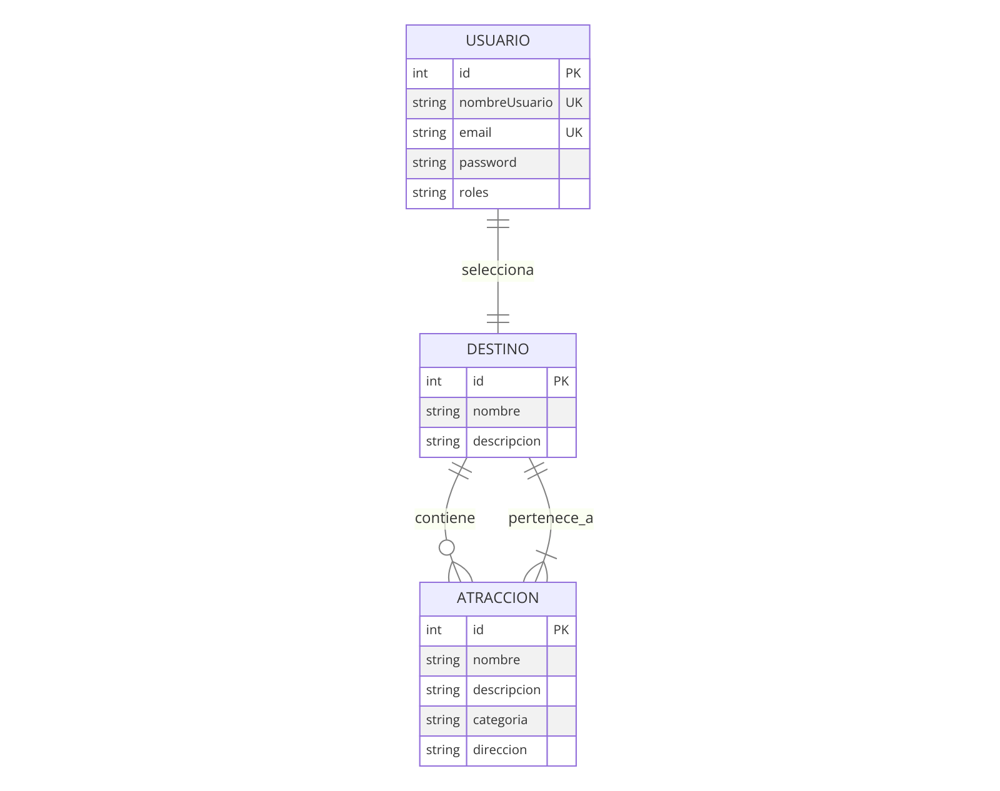

# Definición de Entidades

**Entidades:**

- **Atracción:** Representa lugares de interés dentro de un destino. Atributos incluyen ID, nombre, descripción, categoría, dirección, y destino asociado.
- **Destino:** Define ubicaciones que los usuarios pueden explorar. Incluye ID, nombre, descripción, y una lista de atracciones.
- **Usuario:** Almacena información de los usuarios, con atributos como ID, nombre de usuario (email), contraseña, y roles para control de acceso.
 

## Relaciones entre Entidades

- Un **Usuario** puede seleccionar múltiples **Destinos**.
- Un **Destino** contiene múltiples **Atracciones**.
- **Atracciones** están categorizadas y pueden ser seleccionadas para formar un plan de ocio.

# Diseño de la Base de Datos

Considerando MySQL como sistema de gestión de base de datos, el diseño de la base de datos debe reflejar las entidades y relaciones mencionadas. Esto incluye:

- Tablas para **Usuarios**, **Destinos**, y **Atracciones**.
- Relaciones definidas a través de claves foráneas, por ejemplo, una clave foránea en **Atracciones** apuntando al **Destino** correspondiente.

# Funcionalidades y API Endpoints

## Autenticación

- **Login de usuario:** POST `http://localhost:8081/authenticate/signin`
  - Body: email y contraseña usuario
- **Login de admin:** POST `http://localhost:8081/authenticate/signin`
  - Body: email y contraseña admin

## CRUD para Destinos, Usuarios, y Atracciones

### USUARIO

- LISTAR-GET: `http://localhost:8081/api/usuarios/`
- LISTAR POR ID- GET: `http://localhost:8081/api/usuarios/{{id}}`
- NUEVO USUARIO -POST: `http://localhost:8080/api/usuarios`
- ACTUALIZAR – PUT: `http://localhost:8081/api/usuarios/{{id}}`
- BORRAR – DELETE: `http://localhost:8081/api/usuarios/{{id}}`

### DESTINO

- LISTAR-GET: `http://localhost:8081/api/destinos/`
- LISTAR POR ID- GET: `http://localhost:8081/api/destinos/{{id}}`
- NUEVO DESTINO -POST: `http://localhost:8080/api/destinos`
- ACTUALIZAR – PUT: `http://localhost:8081/api/destinos/{{id}}`
- BORRAR – DELETE: `http://localhost:8081/api/destinos/{{id}}`

### ATRACCIONES

- LISTAR-GET: `http://localhost:8081/api/atracciones/`
- LISTAR POR ID- GET: `http://localhost:8081/api/atracciones/{{id}}`
- NUEVA ATRACCIÓN-POST: `http://localhost:8080/api/atracciones`
- ACTUALIZAR – PUT: `http://localhost:8081/api/atracciones/{{id}}`
- BORRAR – DELETE: `http://localhost:8081/api/atracciones/{{id}}`

## Relaciones y Lógica de Negocio

- Listar atracciones por destino (GET `/destinos/{id}/atracciones`)
- Añadir atracción por destino (POST `/destinos/{id}/atracciones`)
- Sugerir planes de ocio combinando atracciones de diferentes categorías por destino (GET `/destinos/{id}/planes`)

# Documentación y Diagramas

## Controladores

### AtraccionController:

- Endpoints para listar todas las atracciones, obtener, crear, actualizar, y eliminar una atracción por ID.

### DestinoController:

- Endpoints para listar todos los destinos y sus atracciones, obtener, crear, actualizar, y eliminar un destino por ID.

### UsuarioController:

- Endpoints para listar todos los usuarios, obtener, crear, actualizar, y eliminar un usuario por ID.

## Configuración de Seguridad (SecurityConfig)

Establece reglas para proteger endpoints de la API, usando JWT para autenticación. Define permisos basados en roles para operaciones CRUD en los endpoints relacionados con usuarios, destinos, y atracciones. Utiliza BCryptPasswordEncoder para la seguridad de las contraseñas.

## Diagramas

- **Diagrama de Entidad-Relación (ER):** Para visualizar las entidades y sus relaciones.
  
(Aquí va una imagen)

- **Diagramas de Clases:** Para el diseño de la estructura de clases que se implementará en Spring Boot.
  
.png)

- **Diagrama de Secuencia:** Para mostrar cómo interactúan las diferentes partes del sistema durante una operación típica, como la sugerencia de planes de ocio.
  
.png)

# Lógica de Negocio Adicional

- Implementación de seguridad y autenticación, posiblemente usando JWT para manejar sesiones de usuario y admin.
- Algoritmos para sugerir planes de ocio, considerando las preferencias del usuario y la disponibilidad de atracciones en cada categoría.
- Algoritmos para sugerir planes de ocio, considerando un presupuesto sugerido por el usuario.
- Implementación de opiniones y puntuación a destinos y atracciones.
- Implementación de una mini red social donde los usuarios puedan hacer planes en conjunto.
